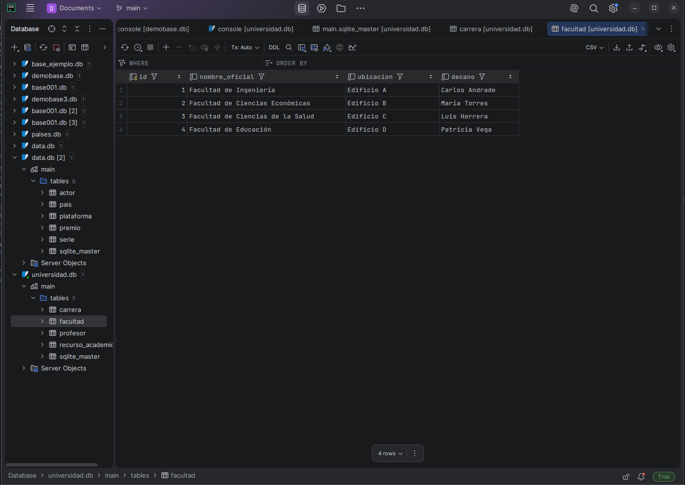
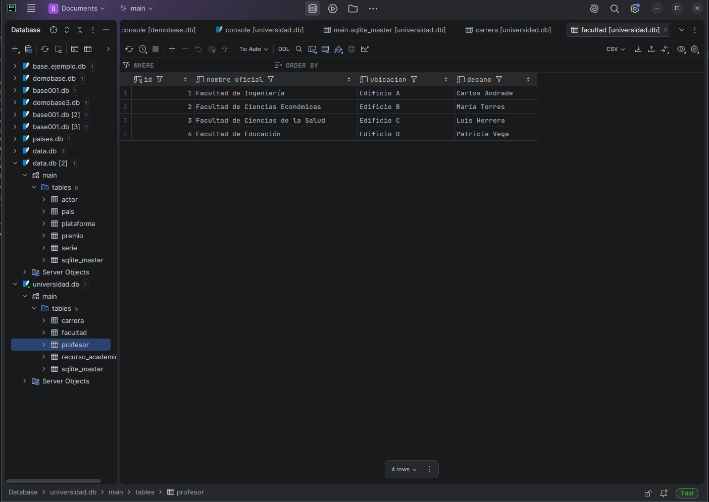
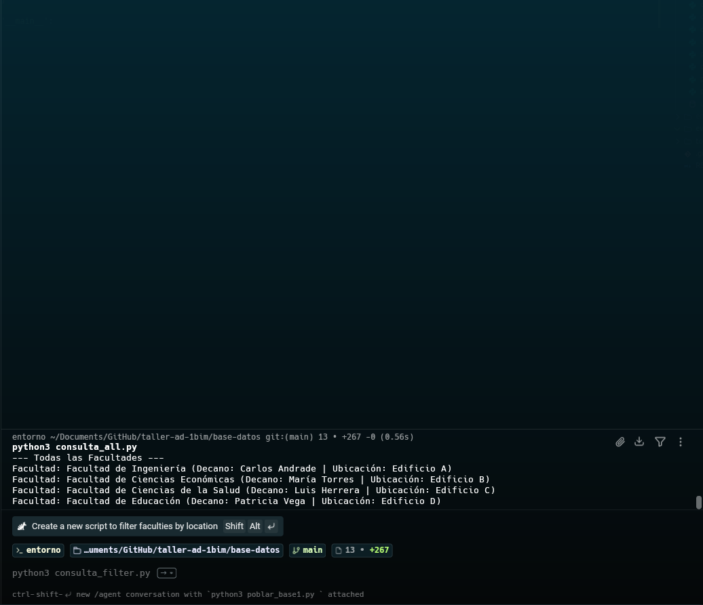
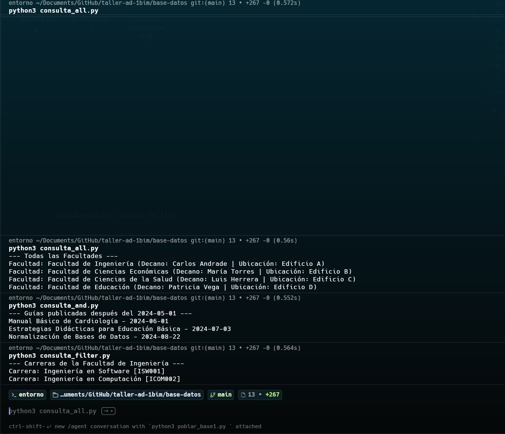
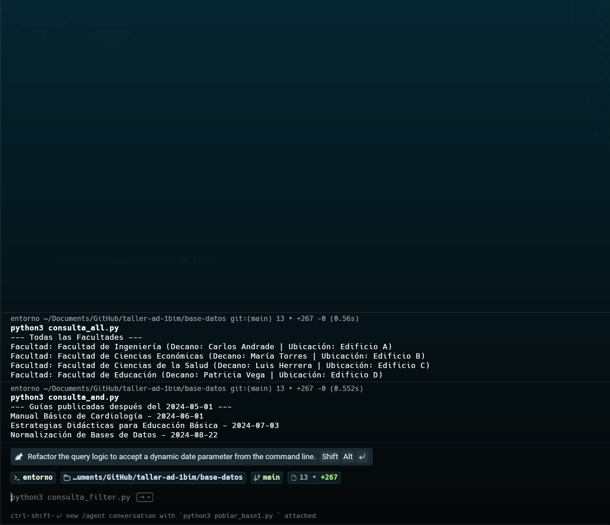

# Evidencias del Taller de Bases de Datos con SQLAlchemy

Este documento contiene el resumen visual de las operaciones y scripts ejecutados para la resolución de la problemática del taller. Todo el código fue desarrollado haciendo uso de Python y el ORM de SQLAlchemy.

## 1. Inserción de Datos (Scripts `poblar_base*.py`)

Se pobló la base de datos a partir de la información de los archivos `.json`, respetando el orden lógico de dependencias entre las tablas (llaves foráneas).

* **Facultades (`poblar_base1.py`)**
  

* **Carreras (`poblar_base2.py`)**
  

* **Profesores (`poblar_base3.py`)**
  

* **Recursos Académicos (`poblar_base4.py`)**
  

---

## 2. Ejecución de Consultas (Scripts `consulta_*.py`)

Una vez la base de datos se encontró poblada, se verificó el correcto funcionamiento extrayendo la información mediante distintas cláusulas de SQLAlchemy.

### Consulta Básica (`.all()`)
Trae todos los registros de una tabla en específico.

### Consulta con Filtros Simples (`.filter()`)
Trae registros que coincidan con un criterio en particular (por ejemplo, carreras dentro de una misma facultad).

### Consulta con Ordenamiento (`.order_by()`)
Permite ordenar los resultados por un campo en específico, como por ejemplo orden alfabético.

### Consulta con Operador Lógico `or_()`
Devuelve registros si cumplen al menos una de las condiciones establecidas (ej: recurso que sea Libro o Video).

### Consulta con Operador Lógico `and_()`
Devuelve registros exclusivamente cuando cumplen todas las condiciones establecidas a la vez.

