# Evidencias del Taller de Bases de Datos con SQLAlchemy

Este documento contiene el resumen visual de las operaciones y scripts ejecutados para la resolución de la problemática del taller. Todo el código fue desarrollado haciendo uso de Python y el ORM de SQLAlchemy. Se configuraron y validaron dos motores de bases de datos: **PostgreSQL** y **MariaDB**.

---

## 1. Inserción de Datos General (Scripts `poblar_base*.py`)

Se pobló la base de datos a partir de la información de los archivos `.json`, respetando el orden lógico de dependencias entre las tablas (llaves foráneas).

* **Facultades (`poblar_base1.py`)**
  

* **Carreras (`poblar_base2.py`)**
  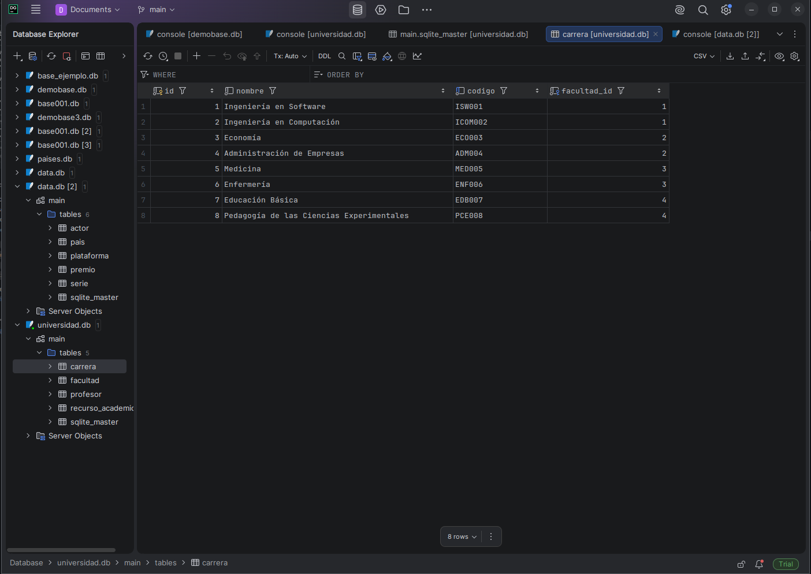

* **Profesores (`poblar_base3.py`)**
  

* **Recursos Académicos (`poblar_base4.py`)**
  

---

## 2. Ejecución de Consultas Generales (Scripts `consulta_*.py`)

Una vez la base de datos se encontró poblada, se verificó el correcto funcionamiento extrayendo la información mediante distintas cláusulas de SQLAlchemy.

### Consulta Básica (`.all()`)
Trae todos los registros de una tabla en específico.

### Consulta con Filtros Simples (`.filter()`)
Trae registros que coincidan con un criterio en particular (por ejemplo, carreras dentro de una misma facultad).

### Consulta con Ordenamiento (`.order_by()`)
Permite ordenar los resultados por un campo en específico, como por ejemplo orden alfabético.
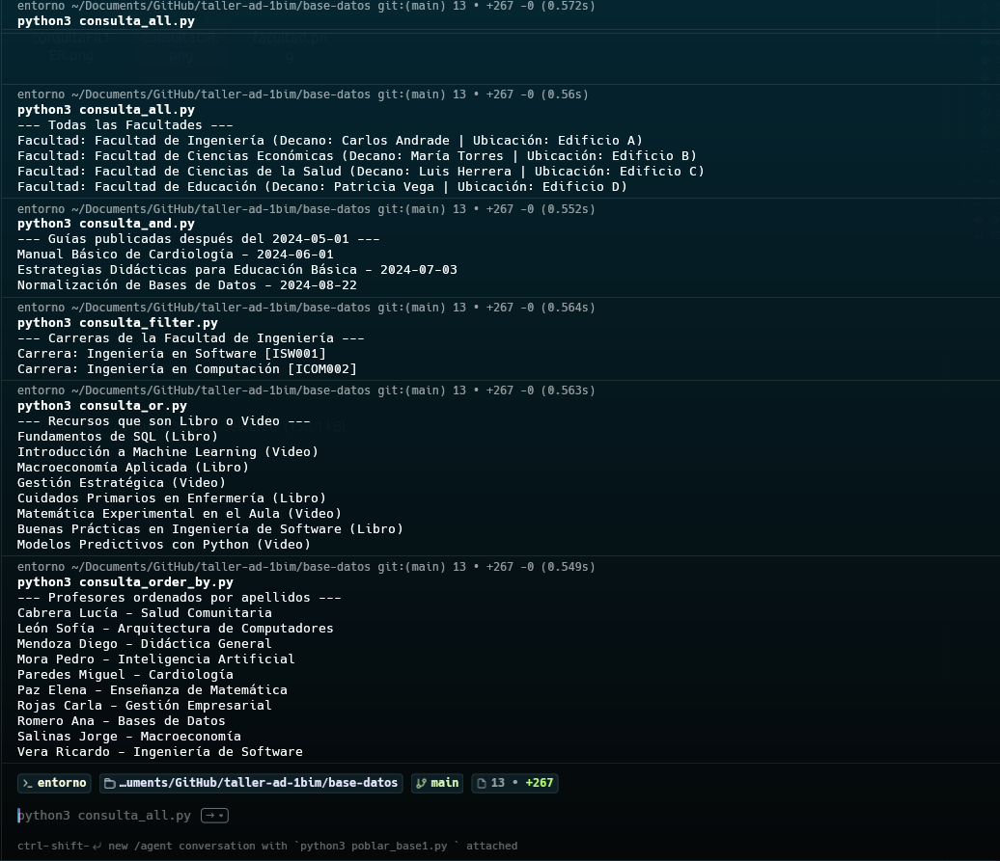

### Consulta con Operador Lógico `or_()`
Devuelve registros si cumplen al menos una de las condiciones establecidas (ej: recurso que sea Libro o Video).
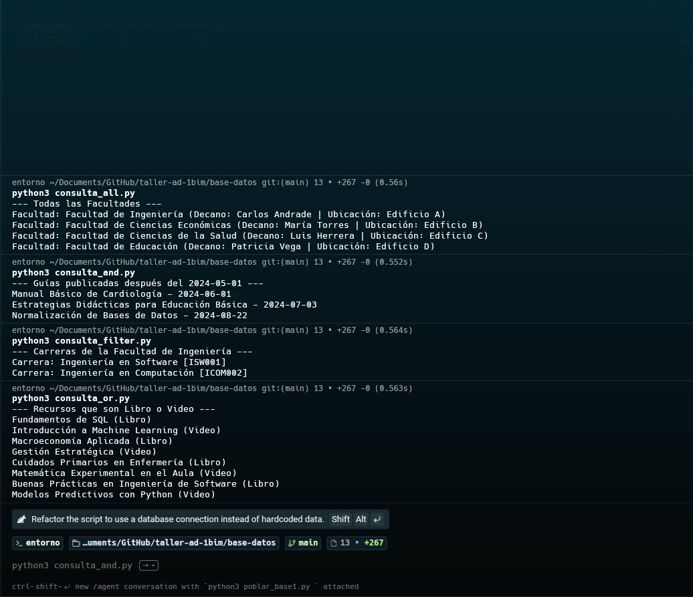

### Consulta con Operador Lógico `and_()`
Devuelve registros exclusivamente cuando cumplen todas las condiciones establecidas a la vez.

### D. Ejecución de Consultas Nueva
Presentar los recursos académicos de una facultad específica.
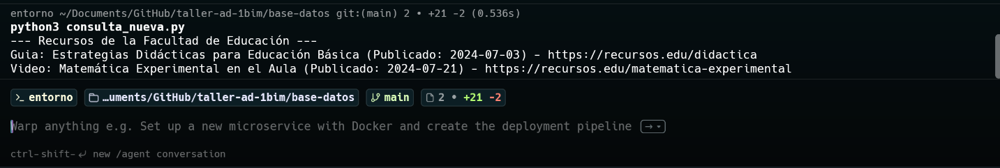

---

## 3. Evidencias en PostgreSQL

Se configuró el motor de PostgreSQL a través de la cadena de conexión de SQLAlchemy, levantado sobre un contenedor de Docker.

### A. Generación de Tablas
Al ejecutar el script de creación de entidades, se generaron las siguientes tablas en la base de datos de PostgreSQL:

* **Tabla Facultad:**
  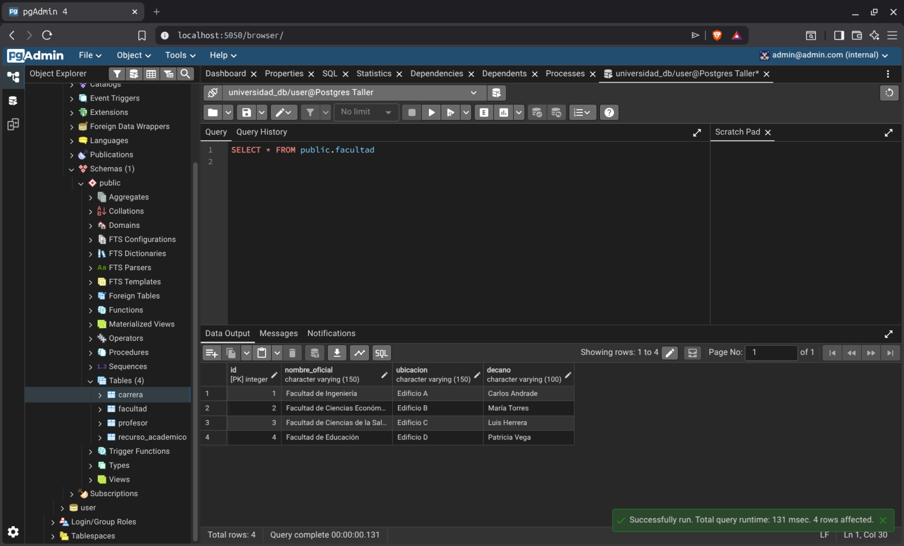

* **Tabla Carrera:**
  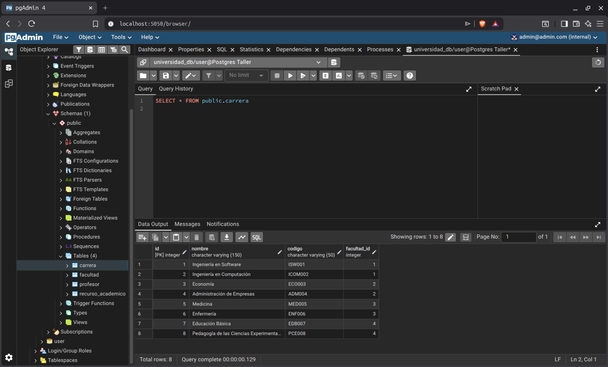

* **Tabla Profesor:**
  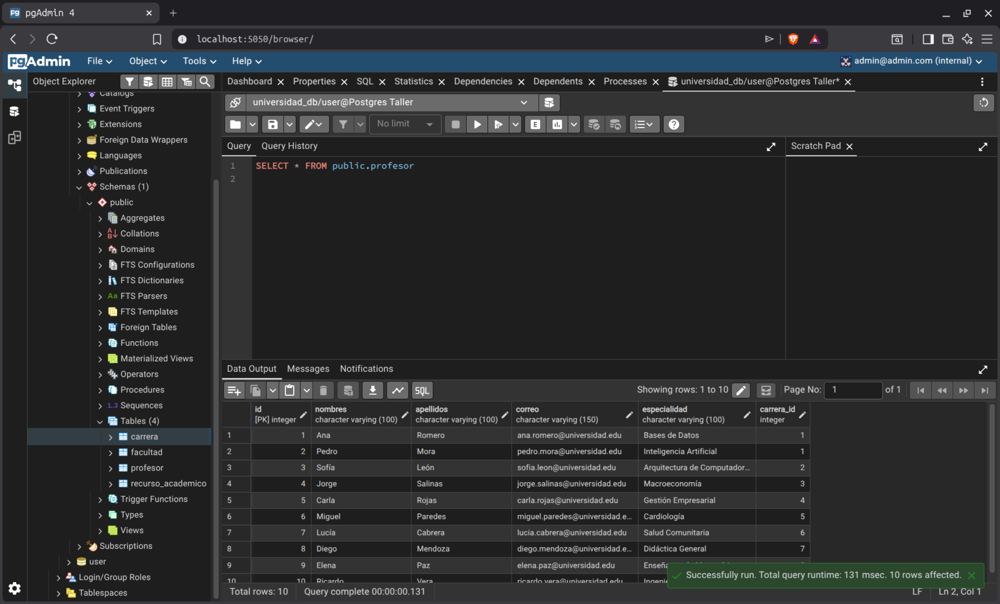

* **Tabla Recurso Académico:**
  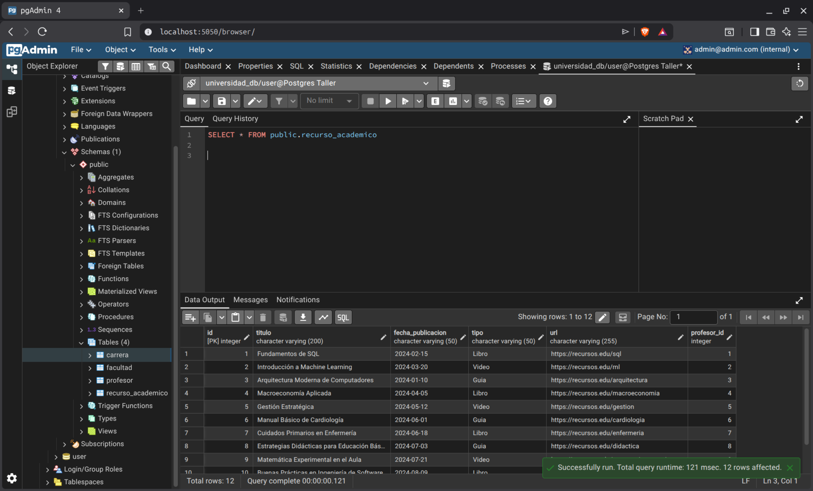

### B. Población de Datos
Evidencia de la correcta ejecución de la inserción y carga de datos en la base de datos de PostgreSQL:
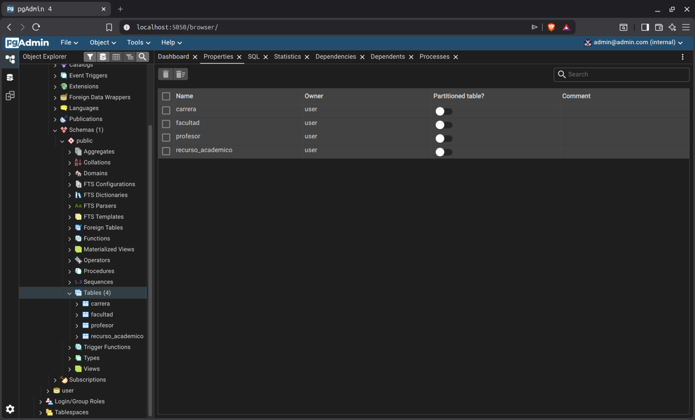

### C. Ejecución de Consultas
Captura que muestra el resultado de las consultas ejecutadas sobre el motor de PostgreSQL:
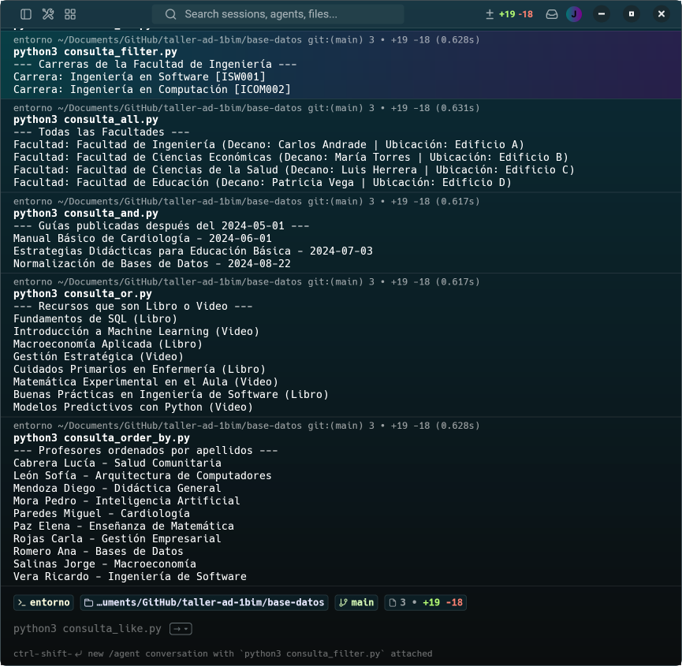

### D. Ejecución de Consultas Nueva
Presentar los recursos académicos de una facultad específica.

---

## 4. Evidencias en MariaDB

Se configuró el motor de MariaDB a través de la cadena de conexión de SQLAlchemy, también corriendo sobre un contenedor de Docker.

### A. Generación de Tablas
Al ejecutar el script de creación de entidades con el motor correspondiente, se crearon las siguientes tablas en MariaDB:

* **Tabla Facultad:**
  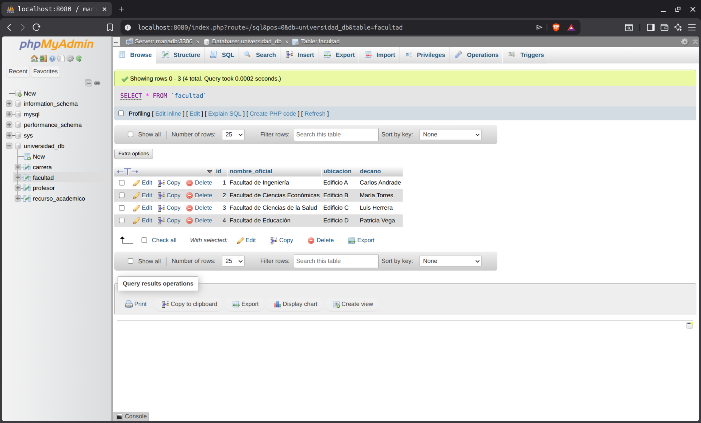

* **Tabla Carrera:**
  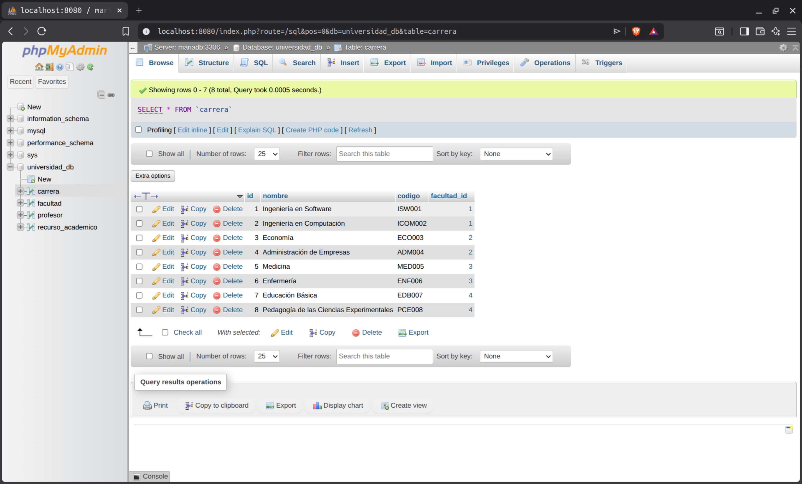

* **Tabla Profesor:**
  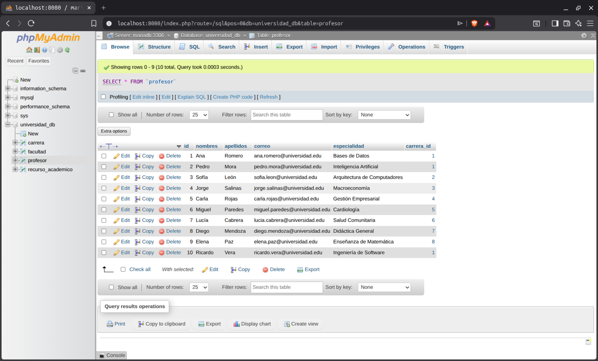

* **Tabla Recurso Académico:**
  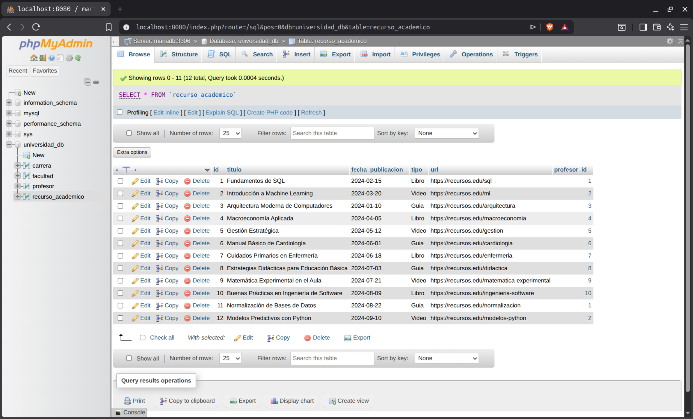

### B. Población de Datos
Evidencia de la correcta ejecución de la inserción y carga de datos en la base de datos de MariaDB:
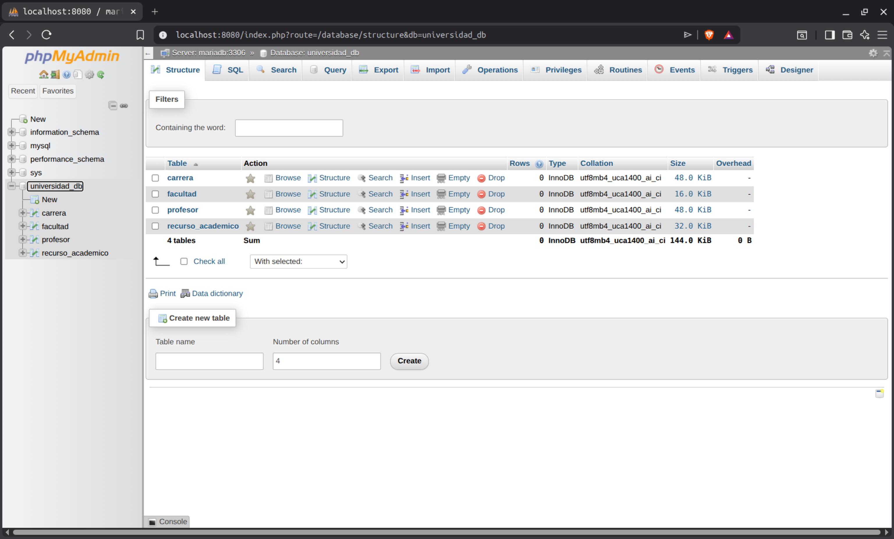

### C. Ejecución de Consultas
Captura que muestra el resultado de las consultas ejecutadas sobre el motor de MariaDB:
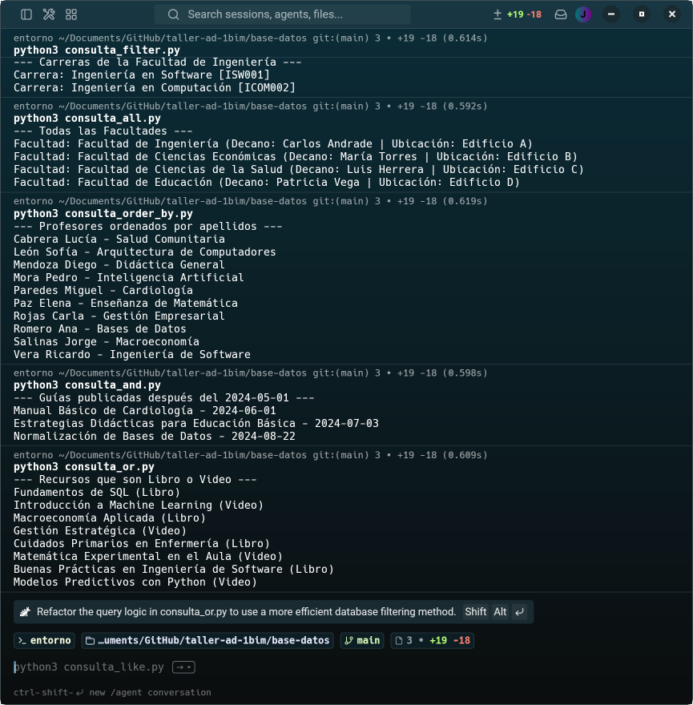

### D. Ejecución de Consultas Nueva
Presentar los recursos académicos de una facultad específica.
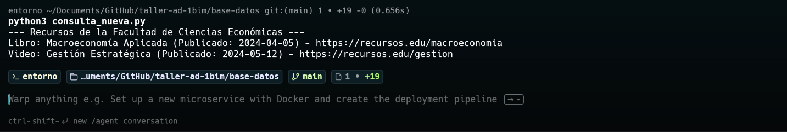

